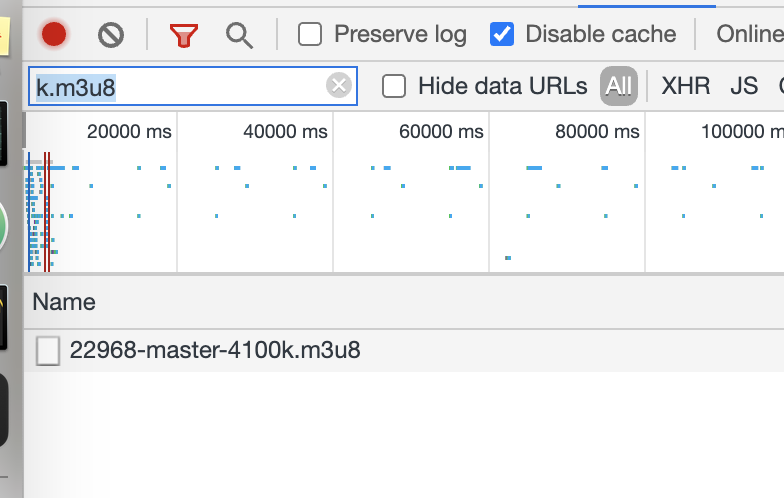
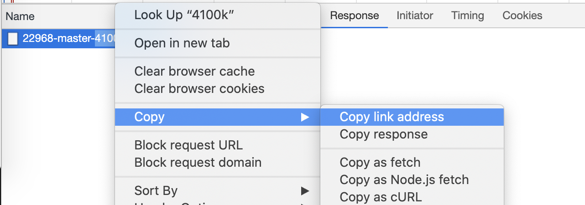

Blueprint Downloader
=====

1. `yarn install`
2. Go to your blueprint library. Open chrome dev tools. Switch to the network tab
3. Before you hit play on a video add this into the network tab filter box k.m3u8



4. Copy the master m3u link address



Now run

```
yarn download --name 'the_filename_you_want_no_extension' --m3u <the link you copied>
```

Enjoy!

## Example

```
yarn download --name data/travel_bag --m3u https://...k.m3u8
```

